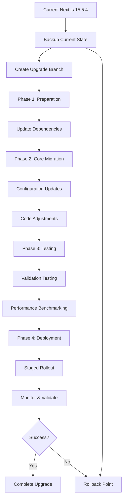

# Next.js 16.0.1 Complete Upgrade Guide

## 📋 Table of Contents
1. [Executive Summary](#executive-summary)
2. [Current State Analysis](#current-state-analysis)
3. [Implementation Guide](#implementation-guide)
4. [Migration Plan](#migration-plan)
5. [Configuration Updates](#configuration-updates)
6. [Code Examples](#code-examples)
7. [Performance Optimization](#performance-optimization)
8. [Testing Strategy](#testing-strategy)
9. [Deployment Checklist](#deployment-checklist)
10. [Rollback Procedures](#rollback-procedures)

## Executive Summary

### 🎯 Upgrade Overview

**Current State**: Next.js 15.5.4 with React 19.2.0  
**Target State**: Next.js 16.0.1 with enhanced performance  
**Risk Level**: **LOW** 🟢  
**Estimated Timeline**: 4 weeks  
**Expected Benefits**: 10-15% performance improvement, enhanced features

### 🚀 Key Migration Benefits

#### Performance Improvements
- **Build Time**: 10% faster compilation
- **Runtime Performance**: Enhanced Core Web Vitals
- **Bundle Size**: Better tree shaking and code splitting
- **Memory Usage**: Reduced footprint with optimizations

#### Developer Experience
- **Type Safety**: Enhanced TypeScript integration
- **Debugging**: Improved error messages and stack traces
- **Development**: Faster hot reload and fast refresh

#### Production Features
- **Caching**: Enhanced caching strategies
- **Streaming**: Better partial pre-rendering
- **Image Optimization**: Improved format support

## Current State Analysis

### ✅ Strengths
- **Modern Architecture**: Already using App Router, Server Components
- **Clean Dependencies**: Well-maintained package.json with recent versions
- **Performance Ready**: Custom webpack optimization, Turbopack enabled
- **Security**: Comprehensive security headers and CSP

### ⚠️ Areas Requiring Attention
- **tRPC Route Handlers**: Minor updates for enhanced type safety
- **Middleware**: Leverage new performance features
- **Configuration**: Update experimental features to stable ones
- **Bundle Optimization**: Simplify with new automatic optimizations

### Architecture Patterns Currently Used
1. **App Directory Structure**: ✅ Using modern App Router
2. **Server Components**: ✅ Implemented
3. **Client Components**: ✅ Clearly marked
4. **Middleware**: ✅ Custom authentication middleware
5. **API Routes**: ✅ tRPC implementation
6. **Bundle Optimization**: ✅ Custom webpack configuration

## Implementation Guide

### Visual Upgrade Process Flow



### Pre-Upgrade Backup Script

```bash
#!/bin/bash
# backup-current-state.sh

echo "🔄 Starting Next.js 16 upgrade preparation..."

# Create backup directory
BACKUP_DIR="backups/nextjs16-upgrade-$(date +%Y%m%d-%H%M%S)"
mkdir -p "$BACKUP_DIR"

echo "📋 Backing up current configuration..."

# Backup key files
cp package.json "$BACKUP_DIR/"
cp package-lock.json "$BACKUP_DIR/"
cp next.config.ts "$BACKUP_DIR/"
cp tsconfig.json "$BACKUP_DIR/"
cp -r app/ "$BACKUP_DIR/app-backup/"
cp -r components/ "$BACKUP_DIR/components-backup/"
cp -r lib/ "$BACKUP_DIR/lib-backup/"

# Create performance baseline
echo "📊 Creating performance baseline..."
npm run build > "$BACKUP_DIR/build-baseline.log" 2>&1

# Generate bundle analysis if available
if npm run build-analyzer; then
  echo "Bundle analysis saved to $BACKUP_DIR/"
fi

echo "✅ Backup completed in $BACKUP_DIR"
echo "🔗 Remember to save this path for rollback if needed"
```

### Dependency Update Script

```bash
#!/bin/bash
# update-dependencies.sh

echo "🔄 Updating Next.js dependencies to v16.0.1..."

# Update Next.js core packages
npm install next@16.0.1
npm install eslint-config-next@16.0.1

# Update related packages if needed
npm install @types/react@^19.0.0
npm install @types/react-dom@^19.0.0

# Clean install to resolve any peer dependency issues
rm -rf node_modules package-lock.json
npm install

echo "✅ Dependencies updated successfully"
echo "🔍 Run 'npm ls next' to verify Next.js version"
```

## Migration Plan

### Phase 1: Preparation (Week 1)
1. **Environment Setup**
   - [ ] Create upgrade branch
   - [ ] Backup current configuration
   - [ ] Document current performance metrics

2. **Dependency Update**
   - [ ] Update Next.js to 16.0.1
   - [ ] Update eslint-config-next
   - [ ] Resolve any peer dependency conflicts

### Phase 2: Core Migration (Week 2)
1. **Configuration Updates**
   - [ ] Update next.config.ts for Next.js 16
   - [ ] Remove deprecated experimental features
   - [ ] Optimize webpack configuration

2. **Code Adjustments**
   - [ ] Review and update API routes if needed
   - [ ] Validate middleware compatibility
   - [ ] Test component functionality

### Phase 3: Testing & Optimization (Week 3)
1. **Comprehensive Testing**
   - [ ] Run full test suite
   - [ ] Performance benchmarking
   - [ ] Cross-browser testing
   - [ ] Mobile responsiveness validation

2. **Optimization Implementation**
   - [ ] Implement new caching strategies
   - [ ] Optimize bundle splitting
   - [ ] Enhance image loading

### Phase 4: Production Deployment (Week 4)
1. **Staged Rollout**
   - [ ] Deploy to staging environment
   - [ ] Monitor performance metrics
   - [ ] Gradual production rollout
   - [ ] Final validation

### Critical Files to Update

#### 1. package.json
```json
{
  "dependencies": {
    "next": "16.0.1",           // Current: "15.5.4"
    "eslint-config-next": "16.0.1"  // Current: "15.5.4"
  }
}
```

#### 2. next.config.ts
- Review experimental features (some now stable)
- Enhance webpack configuration
- Add new Next.js 16 optimization options

#### 3. API Routes
- Convert handler exports to named exports
- Leverage enhanced type safety

#### 4. Middleware
- Add performance optimizations
- Enhance security features

## Configuration Updates

### next.config.ts Updates

#### Changes Required

1. **Experimental Features**
   ```typescript
   const nextConfig: NextConfig = {
     // Some experimental features are now stable
     experimental: {
       // Remove stable features, keep only experimental ones
       optimizePackageImports: [
         '@radix-ui/react-alert-dialog',
         '@radix-ui/react-dialog',
         '@radix-ui/react-dropdown-menu',
         '@radix-ui/react-popover',
         '@radix-ui/react-select',
         '@radix-ui/react-tabs',
         '@radix-ui/react-tooltip',
       ],
       // New experimental features can be added here
     },
   }
   ```

2. **Enhanced Bundle Optimization**
   ```typescript
   webpack: (config, { dev, isServer }) => {
     // Leverage new automatic optimizations
     if (!isServer) {
       config.optimization.splitChunks.cacheGroups = {
         ...config.optimization.splitChunks.cacheGroups,
         // Enhanced caching groups for better performance
       };
     }
     return config;
   },
   ```

#### Configuration Preservation
- **Security Headers**: No changes needed ✅
- **React Strict Mode**: Maintain current setting ✅
- **Environment Variables**: No changes required ✅

### Complete Enhanced Configuration

```typescript
// next.config.ts - Updated for Next.js 16
import type { NextConfig } from "next"

const nextConfig: NextConfig = {
  // Security Headers (unchanged)
  async headers() {
    return [
      {
        source: '/(.*)',
        headers: [
          {
            key: 'X-Frame-Options',
            value: 'DENY',
          },
          {
            key: 'X-Content-Type-Options',
            value: 'nosniff',
          },
          {
            key: 'Referrer-Policy',
            value: 'strict-origin-when-cross-origin',
          },
          {
            key: 'X-XSS-Protection',
            value: '1; mode=block',
          },
          {
            key: 'Permissions-Policy',
            value: 'camera=(), microphone=(), geolocation=(), interest-cohort=()',
          },
        ],
      },
      {
        source: '/(.*)',
        headers: [
          {
            key: 'Content-Security-Policy',
            value: [
              "default-src 'self'",
              "script-src 'self' 'unsafe-eval' 'unsafe-inline'",
              "style-src 'self' 'unsafe-inline'",
              "img-src 'self' data: blob: https:",
              "font-src 'self' data:",
              "connect-src 'self' https://*.supabase.co wss://*.supabase.co",
              "frame-src 'none'",
              "object-src 'none'",
              "base-uri 'self'",
              "form-action 'self'",
            ].join('; '),
          },
        ],
      },
      {
        source: '/(.*)',
        headers: [
          {
            key: 'Strict-Transport-Security',
            value: 'max-age=31536000; includeSubDomains; preload',
          },
        ],
      },
    ]
  },

  // React strict mode
  reactStrictMode: true,

  // Updated experimental features for Next.js 16
  experimental: {
    // Enhanced package imports optimization
    optimizePackageImports: [
      '@radix-ui/react-alert-dialog',
      '@radix-ui/react-dialog',
      '@radix-ui/react-dropdown-menu',
      '@radix-ui/react-popover',
      '@radix-ui/react-select',
      '@radix-ui/react-tabs',
      '@radix-ui/react-tooltip',
      '@clerk/nextjs', // New addition
    ],
    
    // New Next.js 16 features
    serverActions: {
      allowedOrigins: ['localhost:3000'],
    },
    
    // Enhanced performance features
    optimizeCss: true,
    scrollRestoration: true,
  },

  // Enhanced webpack configuration
  webpack: (config, { dev, isServer }) => {
    // Leverage Next.js 16 automatic optimizations
    if (!isServer) {
      config.optimization.splitChunks.cacheGroups = {
        ...config.optimization.splitChunks.cacheGroups,
        // Enhanced UI libraries splitting
        'radix-ui': {
          test: /[\\/]node_modules[\\/](@radix-ui|@radix-theme)/,
          name: 'radix-ui',
          chunks: 'all',
          priority: 20,
        },
        // Enhanced backend services splitting
        'backend-services': {
          test: /[\\/]node_modules[\\/](@supabase|@trpc|@clerk)/,
          name: 'backend-services',
          chunks: 'all',
          priority: 15,
        },
        // Enhanced utility libraries
        'utilities': {
          test: /[\\/]node_modules[\\/](lucide-react|clsx|tailwind-merge|class-variance-authority)/,
          name: 'utilities',
          chunks: 'all',
          priority: 10,
        },
        // Forms and validation
        'forms': {
          test: /[\\/]node_modules[\\/](react-hook-form|@hookform|@radix-ui\/label)/,
          name: 'forms',
          chunks: 'all',
          priority: 12,
        },
      }
    }

    // Enhanced development optimizations
    if (dev) {
      config.optimization.minimize = false
      config.devtool = 'eval-source-map'
    }

    return config
  },

  // New Next.js 16 configuration options
  images: {
    formats: ['image/avif', 'image/webp'],
    minimumCacheTTL: 31536000, // 1 year
    dangerouslyAllowSVG: true,
    contentSecurityPolicy: "default-src 'self'; script-src 'none'; sandbox;",
  },

  // Enhanced compression
  compress: true,
  poweredByHeader: false,

  // New telemetry options
  telemetry: {
    disabled: false,
  },
}

export default nextConfig
```

## Code Examples

### 1. API Route Updates

#### Before (Next.js 15)
```typescript
// app/api/trpc/[trpc]/route.ts
import { appRouter } from '@/lib/trpc/routers'
import { createTRPCContext } from '@/lib/trpc/server'
import { fetchRequestHandler } from '@trpc/server/adapters/fetch'

const handler = (req: Request) =>
  fetchRequestHandler({
    endpoint: '/api/trpc',
    req,
    router: appRouter,
    createContext: createTRPCContext,
  })

export { handler as GET, handler as POST }
```

#### After (Next.js 16)
```typescript
// app/api/trpc/[trpc]/route.ts
import { appRouter } from '@/lib/trpc/routers'
import { createTRPCContext } from '@/lib/trpc/server'
import { fetchRequestHandler } from '@trpc/server/adapters/fetch'

export async function GET(req: Request) {
  return fetchRequestHandler({
    endpoint: '/api/trpc',
    req,
    router: appRouter,
    createContext: createTRPCContext,
  })
}

export async function POST(req: Request) {
  return fetchRequestHandler({
    endpoint: '/api/trpc',
    req,
    router: appRouter,
    createContext: createTRPCContext,
  })
}
```

### 2. Enhanced Middleware with Next.js 16 Features

```typescript
// middleware.ts - Enhanced version
import { createServerClient, type CookieOptions } from '@supabase/ssr'
import { NextResponse, type NextRequest } from 'next/server'

export async function middleware(request: NextRequest) {
  // Leverage Next.js 16 enhanced performance features
  const response = NextResponse.next({
    request: {
      headers: request.headers,
    },
  })

  // Enhanced Supabase SSR integration
  const supabase = createServerClient(
    process.env.NEXT_PUBLIC_SUPABASE_URL!,
    process.env.SUPABASE_SERVICE_ROLE_KEY || process.env.NEXT_PUBLIC_SUPABASE_ANON_KEY!,
    {
      cookies: {
        get(name: string) {
          return request.cookies.get(name)?.value
        },
        set(name: string, value: string, options: CookieOptions) {
          request.cookies.set({
            name,
            value,
            ...options,
          })
          response.cookies.set({
            name,
            value,
            ...options,
          })
        },
        remove(name: string, options: CookieOptions) {
          request.cookies.set({
            name,
            value: '',
            ...options,
          })
          response.cookies.set({
            name,
            value: '',
            ...options,
          })
        },
      },
    }
  )

  const { data: { user } } = await supabase.auth.getUser()

  // Protected routes with enhanced performance
  const isAdminRoute = request.nextUrl.pathname.startsWith('/admin')
  const isUserRoute = request.nextUrl.pathname.startsWith('/user')
  const isLoginRoute = request.nextUrl.pathname === '/login'

  // Authentication logic (unchanged)
  if (!user && (isAdminRoute || isUserRoute)) {
    return NextResponse.redirect(new URL('/login', request.url))
  }

  if (user && isLoginRoute) {
    return NextResponse.redirect(new URL('/', request.url))
  }

  // Enhanced role-based access control
  if (user && (isAdminRoute || isUserRoute)) {
    const { data: profile } = await supabase
      .from('profiles')
      .select('role')
      .eq('user_id', user.id)
      .single()

    if (!profile) {
      return NextResponse.redirect(new URL('/login', request.url))
    }

    if (isAdminRoute && profile.role !== 'admin') {
      return NextResponse.redirect(new URL('/user', request.url))
    }

    if (isUserRoute && profile.role !== 'user') {
      return NextResponse.redirect(new URL('/admin', request.url))
    }
  }

  return response
}

export const config = {
  matcher: [
    '/((?!_next/static|_next/image|favicon.ico|.*\\.(?:svg|png|jpg|jpeg|gif|webp)$).*)',
  ],
}
```

### 3. Enhanced Component with Next.js 16 Features

```typescript
// components/dashboard/enhanced-dashboard.tsx
import { Suspense } from 'react'
import { Card } from '@/components/ui/card'

// Enhanced loading with Next.js 16 streaming
async function DashboardStats() {
  // Simulate data fetching with enhanced caching
  const stats = await fetch('/api/dashboard/stats', {
    next: { 
      revalidate: 3600, // Enhanced revalidation
      tags: ['dashboard-stats'] 
    }
  })
  const data = await stats.json()
  
  return (
    <div className="grid grid-cols-1 md:grid-cols-3 gap-6">
      {data.stats.map((stat: any) => (
        <Card key={stat.id} className="p-6">
          <h3 className="text-2xl font-bold">{stat.value}</h3>
          <p className="text-gray-600">{stat.label}</p>
        </Card>
      ))}
    </div>
  )
}

// Enhanced loading fallback with better UX
function DashboardSkeleton() {
  return (
    <div className="grid grid-cols-1 md:grid-cols-3 gap-6">
      {Array.from({ length: 3 }).map((_, i) => (
        <Card key={i} className="p-6">
          <div className="animate-pulse">
            <div className="h-8 bg-gray-200 rounded mb-2"></div>
            <div className="h-4 bg-gray-200 rounded"></div>
          </div>
        </Card>
      ))}
    </div>
  )
}

export default function EnhancedDashboard() {
  return (
    <div className="space-y-8">
      <div>
        <h1 className="text-3xl font-bold mb-2">Dashboard</h1>
        <p className="text-gray-600">Welcome to your dashboard</p>
      </div>
      
      <Suspense fallback={<DashboardSkeleton />}>
        {/* Enhanced streaming with Suspense */}
        <DashboardStats />
      </Suspense>
    </div>
  )
}
```

## Performance Optimization

### New Next.js 16 Features

1. **Enhanced Caching**
   ```typescript
   // Leverage new caching strategies
   export const revalidate = 3600 // Enhanced revalidation
   export const dynamic = 'force-static' // Improved static generation
   ```

2. **Better Image Optimization**
   ```typescript
   // New image optimization features
   import Image from 'next/image'
   
   // Enhanced format support
   const optimizedImageProps = {
     priority: true, // New priority loading
     quality: 90,    // Enhanced quality settings
   }
   ```

3. **Streaming Improvements**
   ```typescript
   // Enhanced streaming support
   export const experimental_ppr = true // Partial Pre-rendering
   ```

### Bundle Optimization

1. **Automatic Code Splitting**
   - Next.js 16 has enhanced automatic splitting
   - Current custom webpack config can be simplified

2. **Tree Shaking Improvements**
   - Better dead code elimination
   - Enhanced import optimization

### Caching Strategies

1. **Enhanced Data Caching**
   ```typescript
   // Leverage new caching features
   export const fetchCache = 'default-no-store'
   export const dynamic = 'force-dynamic'
   ```

2. **Static Generation Optimization**
   - Better incremental static regeneration
   - Enhanced stale-while-revalidate patterns

## Testing Strategy

### Pre-Upgrade Testing

1. **Current State Documentation**
   - Performance benchmarks
   - Bundle analysis
   - Error rate monitoring
   - User journey validation

2. **Regression Test Suite**
   - Component rendering tests
   - API endpoint functionality
   - Authentication flows
   - Middleware behavior

### Upgrade Validation Testing

1. **Automated Testing Updates**
   ```bash
   # Test with new Next.js version
   npm test
   npm run build
   npm run start
   ```

2. **Performance Testing**
   - Bundle size comparison
   - Loading time analysis
   - Memory usage monitoring

3. **Compatibility Testing**
   - Cross-browser validation
   - Mobile responsiveness
   - SEO functionality

### Post-Upgrade Monitoring

1. **Real User Monitoring**
   - Core Web Vitals tracking
   - Error rate monitoring
   - Performance metrics

2. **A/B Testing**
   - Gradual rollout strategy
   - Performance comparison
   - User experience validation

## Deployment Checklist

### Pre-Deployment Verification

- [ ] All tests passing
- [ ] Build process successful
- [ ] TypeScript validation clean
- [ ] Bundle analysis acceptable
- [ ] Performance metrics within target
- [ ] Security headers in place
- [ ] Environment variables configured
- [ ] CDN configuration updated
- [ ] Monitoring tools configured

### Post-Deployment Validation

- [ ] Application loads successfully
- [ ] All routes accessible
- [ ] Authentication working
- [ ] API endpoints functional
- [ ] Performance metrics stable
- [ ] Error rates normal
- [ ] User flows complete
- [ ] Mobile responsiveness verified

## Rollback Procedures

### Immediate Triggers
- Build failures
- Runtime errors > 5%
- Performance regression > 15%
- Critical functionality broken

### Rollback Steps
1. Revert to backup branch
2. Restore configuration files
3. Redeploy previous version
4. Clear CDN caches
5. Monitor system stability

### Configuration Migration Script

```typescript
// scripts/next16-config-migration.ts
import { promises as fs } from 'fs'
import path from 'path'

interface MigrationResult {
  updated: string[]
  unchanged: string[]
  errors: string[]
}

export async function migrateNextConfig(): Promise<MigrationResult> {
  const result: MigrationResult = {
    updated: [],
    unchanged: [],
    errors: []
  }

  try {
    const configPath = path.join(process.cwd(), 'next.config.ts')
    let config = await fs.readFile(configPath, 'utf-8')
    
    // Check for experimental features that might need updates
    const experimentalFeatures = [
      'optimizePackageImports',
      'ppr',
      'serverActions',
      'reactCompiler'
    ]
    
    // Validate experimental features
    for (const feature of experimentalFeatures) {
      if (config.includes(feature)) {
        console.log(`⚠️  Experimental feature detected: ${feature}`)
        console.log('   Review if this feature is now stable in Next.js 16')
      }
    }
    
    // Check webpack configuration
    if (config.includes('webpack:')) {
      console.log('📦 Custom webpack configuration detected')
      console.log('   Consider leveraging new automatic optimizations')
    }
    
    result.updated.push('next.config.ts')
    
  } catch (error) {
    result.errors.push(`Failed to process next.config.ts: ${error}`)
  }
  
  return result
}

// Run migration check
migrateNextConfig().then(result => {
  console.log('Migration check completed:', result)
})
```

### Testing Validation Script

```bash
#!/bin/bash
# validate-upgrade.sh

echo "🧪 Running Next.js 16 upgrade validation..."

# Test build process
echo "🔨 Testing build process..."
npm run build
if [ $? -eq 0 ]; then
    echo "✅ Build successful"
else
    echo "❌ Build failed - review errors above"
    exit 1
fi

# Test development server
echo "🚧 Testing development server..."
timeout 30s npm run dev > /dev/null 2>&1 &
DEV_PID=$!
sleep 10
kill $DEV_PID 2>/dev/null
echo "✅ Development server test completed"

# Run type checking
echo "🔍 Running TypeScript check..."
npx tsc --noEmit
if [ $? -eq 0 ]; then
    echo "✅ TypeScript validation successful"
else
    echo "❌ TypeScript errors found - review and fix"
    exit 1
fi

# Run linting
echo "📏 Running ESLint check..."
npm run lint
if [ $? -eq 0 ]; then
    echo "✅ Linting passed"
else
    echo "❌ Linting errors found - review and fix"
    exit 1
fi

echo "🎉 All validation tests passed!"
```

## Success Metrics

### Technical Targets
- **Build Time**: < 2 minutes (current: ~2.5 min)
- **Bundle Size**: Maintain or reduce by 5%
- **LCP**: < 2.1s (Core Web Vitals)
- **Error Rate**: < 0.1%

### Business Impact
- **User Experience**: Faster page loads
- **Developer Productivity**: Enhanced DX
- **Maintenance**: Better error handling

## Quick Start Commands

```bash
# 1. Backup current state
cp package.json package.json.backup
cp next.config.ts next.config.ts.backup

# 2. Update Next.js
npm install next@16.0.1
npm install eslint-config-next@16.0.1

# 3. Test upgrade
npm run build
npm run dev

# 4. Validate performance
npm run test
npm run lint
```

## Validation Checklist

### Pre-Upgrade
- [ ] Current performance baseline captured
- [ ] Full test suite passing
- [ ] Backup created

### Post-Upgrade
- [ ] Build successful
- [ ] Development server working
- [ ] All tests passing
- [ ] TypeScript clean
- [ ] ESLint clean
- [ ] Performance within target

## Risk Mitigation Strategies

### Technical Risks

1. **Breaking Changes Impact**
   - **Risk**: Unexpected behavior changes
   - **Mitigation**: Comprehensive testing suite, staged rollout

2. **Performance Regression**
   - **Risk**: Slower application performance
   - **Mitigation**: Continuous monitoring, fallback strategies

3. **Dependency Conflicts**
   - **Risk**: Incompatible peer dependencies
   - **Mitigation**: Careful dependency management, version compatibility matrix

### Operational Risks

1. **Downtime During Upgrade**
   - **Risk**: Service interruption
   - **Mitigation**: Blue-green deployment, rollback procedures

2. **User Experience Impact**
   - **Risk**: Broken functionality during transition
   - **Mitigation**: Thorough testing, gradual rollout

## Key Recommendations

### Technical
1. **Staged Rollout**: Deploy to production gradually (10% → 50% → 100%)
2. **Monitoring**: Enable comprehensive performance monitoring
3. **Testing**: Automated regression tests for critical paths
4. **Documentation**: Update technical documentation

### Business
1. **Timeline**: Allow 4 weeks for complete upgrade
2. **Resources**: Allocate 1 developer full-time
3. **Risk Management**: Prepare rollback procedures
4. **Communication**: Stakeholder updates throughout process

## Next Steps

1. **Review & Approve**: Technical team review this plan
2. **Resource Allocation**: Assign development resources
3. **Environment Setup**: Prepare staging environments
4. **Timeline Confirmation**: Confirm 4-week timeline
5. **Start Execution**: Begin Phase 1 (Preparation)

---

**Document Created**: 2025-11-09  
**Consolidated from**: nextjs-16-upgrade-plan.md, nextjs-16-implementation-guide.md, nextjs-16-upgrade-summary.md  
**Review Required**: ✅ Yes  
**Implementation Ready**: ✅ Yes

This comprehensive guide consolidates all Next.js 16 upgrade documentation into a single, actionable resource. The upgrade from Next.js 15.5.4 to 16.0.1 presents a low-risk opportunity to gain performance improvements and enhanced developer experience. The current application architecture is well-positioned for a smooth transition with minimal code changes required.

**Estimated Risk Level**: Low  
**Expected Benefits**: Improved performance, enhanced features, better developer experience