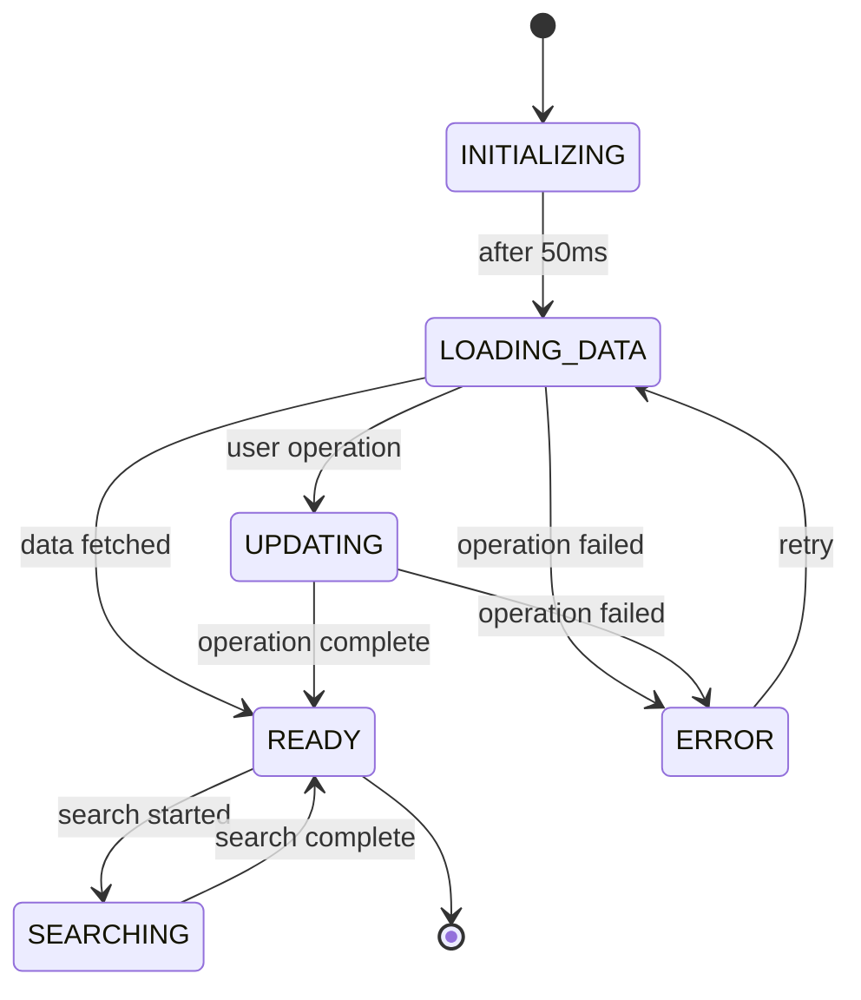

# DualLayerLoadingCoordinator

A comprehensive dual-layer loading state mechanism coordination system for the admin user management interface. This system orchestrates between Layer 1 (UserManagementSkeleton) and Layer 2 (UserOperationModalOverlay) to provide seamless user experiences during data loading and database operations.

## Overview

The DualLayerLoadingCoordinator serves as the "brain" of the dual-layer system, ensuring seamless coordination between skeleton UI and modal overlay for optimal user experience. It implements a sophisticated state machine with 6 phases and provides comprehensive performance monitoring and error handling.

## Key Features

### 🔄 State Machine Implementation
- **INITIALIZING**: Show skeleton immediately (<50ms)
- **LOADING_DATA**: Show modal overlay during database operations (50-200ms+)
- **READY**: Remove both layers, show actual data
- **ERROR**: Coordinate error states with recovery options
- **UPDATING**: Show modal during user modifications
- **SEARCHING**: Coordinate search operations with contextual feedback

### 🎯 Database Operation Coordination
- **Operation Types**: fetch, create, update, delete, search, export, import, bulk
- **Priority Levels**: CRITICAL, HIGH, MEDIUM, LOW with automatic modal selection
- **Progress Tracking**: Real-time progress updates for long operations
- **Contextual Messages**: Dynamic messages based on operation type

### ⚡ Performance Optimization
- **Minimal Re-renders**: Efficient state management with useReducer
- **Smart Timing**: Optimized delays and transitions (50ms skeleton, 200ms+ modal)
- **Memory Management**: Automatic cleanup of timers and event listeners
- **Metrics Collection**: Performance monitoring with automatic warnings

### 🔧 Integration Patterns
- **Event-Driven**: Dispatch events for seamless integration with existing components
- **Manual Control**: Full programmatic control over state transitions
- **tRPC Integration**: Hook-based data fetching with automatic coordination

## Architecture

```
┌─────────────────────────────────────────────────────────────┐
│                    DualLayerLoadingCoordinator              │
├─────────────────────────────────────────────────────────────┤
│  Layer 1: UserManagementSkeleton      Layer 2: ModalOverlay │
│  ┌─────────────────────────────┐     ┌─────────────────────┐│
│  │ • Immediate feedback         │     │ • Database ops      ││
│  │ • Table structure preview    │     │ • Progress tracking ││
│  │ • Minimal resources          │     │ • Contextual msgs   ││
│  │ • Smooth fade-out            │     │ • Error handling    ││
│  └─────────────────────────────┘     └─────────────────────┘│
├─────────────────────────────────────────────────────────────┤
│  State Machine + Performance Monitoring + Error Recovery   │
└─────────────────────────────────────────────────────────────┘
```

## Usage Examples

### 1. Basic Event-Driven Integration

```tsx
import { EventDrivenDualLayerCoordinator, DatabaseOperationType } from './dual-layer-loading-coordinator'

function UserManagement() {
  const handleCreateUser = async () => {
    // Dispatch operation start event
    window.dispatchEvent(new CustomEvent('user-operation-start', {
      detail: {
        operationType: DatabaseOperationType.CREATE_USER,
        priority: LoadingPriority.HIGH,
        customMessage: 'Creating user...',
        customDescription: 'Setting up new user account'
      }
    }))

    try {
      await createUserAPI()
      // Dispatch completion
      window.dispatchEvent(new CustomEvent('user-operation-complete'))
    } catch (error) {
      // Dispatch error
      window.dispatchEvent(new CustomEvent('user-operation-error', {
        detail: { error }
      }))
    }
  }

  return (
    <EventDrivenDualLayerCoordinator
      enableAutoStart={true}
      onStateChange={(state) => console.log('State:', state.currentState)}
      onError={(error) => console.error('Error:', error)}
    >
      <UserManagementTable />
    </EventDrivenDualLayerCoordinator>
  )
}
```

### 2. Manual State Control

```tsx
import { DualLayerLoadingCoordinator } from './dual-layer-loading-coordinator'

function UserManagement() {
  const [coordinatorState, setCoordinatorState] = useState(null)

  const handleDataFetch = async () => {
    // Initialize coordinator
    setCoordinatorState('INITIALIZING')
    
    // Start data loading
    setCoordinatorState('LOADING_DATA')
    
    try {
      const data = await fetchUserData()
      setCoordinatorState('READY')
    } catch (error) {
      setCoordinatorState('ERROR')
    }
  }

  return (
    <DualLayerLoadingCoordinator
      enableAutoStart={false}
      onStateChange={setCoordinatorState}
      config={{
        initialLoadDelay: 100,
        dataReadyThreshold: 300,
        debugMode: true
      }}
    >
      <UserManagementTable />
    </DualLayerLoadingCoordinator>
  )
}
```

### 3. Enhanced UserManagement Integration

```tsx
import UserManagementFinalWithCoordinator from './user-management-final-with-coordinator'

function AdminUsersPage() {
  return (
    <div className="space-y-6">
      <UserManagementFinalWithCoordinator />
    </div>
  )
}
```

## Configuration Options

```typescript
interface CoordinatorConfig {
  initialLoadDelay: number              // Time before showing modal (default: 50ms)
  dataReadyThreshold: number           // Min time to show data (default: 200ms)
  skeletonFadeOutDuration: number      // Skeleton fade duration (default: 300ms)
  modalFadeOutDuration: number         // Modal fade duration (default: 250ms)
  errorRetryDelay: number              // Retry delay (default: 1000ms)
  maxRetries: number                   // Max retry attempts (default: 3)
  enablePerformanceMonitoring: boolean // Enable metrics (default: true)
  debugMode: boolean                   // Debug logging (default: false)
}
```

## State Machine Flow



## Performance Monitoring

The coordinator automatically tracks and reports performance metrics:

```typescript
interface PerformanceMetrics {
  phase1Time: number        // Time to skeleton render
  phase2Time: number        // Time to modal overlay render
  totalLoadTime: number     // Total time to data ready
  operationStartTime: number // Current operation start
  renderCount: number       // Number of re-renders
  lastUpdate: number        // Last update timestamp
}
```

### Performance Warnings
- Load time > 1000ms triggers warning
- Re-render count > 50 triggers optimization alert
- Phase transitions > 500ms indicate potential issues

## Error Handling

### Automatic Error Recovery
- **Retry Logic**: Automatic retries for transient failures
- **Fallback States**: Graceful degradation on errors
- **User Feedback**: Clear error messages with recovery options

### Error Types
- **Network Errors**: Automatic retry with exponential backoff
- **Auth Errors**: Clear user notification and redirect
- **Validation Errors**: Form-level error display
- **Server Errors**: Generic error with contact information

## Integration with Existing Components

### UserManagement Component
The coordinator integrates seamlessly with the existing UserManagement component:

```tsx
// Original component events are preserved
window.dispatchEvent(new CustomEvent('user-operation-start', {
  detail: { state: UserOperationModalState.UPDATING_USER }
}))

// New coordinator events for enhanced coordination
window.dispatchEvent(new CustomEvent('user-operation-complete'))
```

### tRPC Integration
Enhanced tRPC mutations with coordinator integration:

```tsx
const updateUserMutation = trpc.admin.users.updateUser.useMutation({
  onMutate: () => {
    // Coordinator integration
    window.dispatchEvent(new CustomEvent('user-operation-start', {
      detail: {
        operationType: DatabaseOperationType.UPDATE_USER,
        priority: LoadingPriority.HIGH
      }
    }))
  },
  onSuccess: () => {
    window.dispatchEvent(new CustomEvent('user-operation-complete'))
  },
  onError: (error) => {
    window.dispatchEvent(new CustomEvent('user-operation-error', {
      detail: { error: new Error(error.message) }
    }))
  }
})
```

## Customization

### Custom Modal States
```typescript
const CUSTOM_MODAL_CONFIG = {
  [DatabaseOperationType.BULK_IMPORT]: {
    message: 'Importing users...',
    description: 'Processing user import file',
    priority: LoadingPriority.CRITICAL,
    showProgress: true,
    progressLabel: 'Import Progress'
  }
}
```

### Custom Animation Timing
```typescript
const CUSTOM_CONFIG = {
  initialLoadDelay: 100,        // Slower initial load
  dataReadyThreshold: 500,      // Longer data threshold
  skeletonFadeOutDuration: 500, // Smoother fade
  modalFadeOutDuration: 400
}
```

## Testing

### Unit Tests
```typescript
describe('DualLayerLoadingCoordinator', () => {
  it('should show skeleton immediately', () => {
    const { result } = renderHook(() => useDualLayerCoordinator())
    expect(result.current.helpers.shouldShowSkeleton).toBe(true)
  })

  it('should transition to ready state after data fetch', async () => {
    // Test state transitions
  })
})
```

### Integration Tests
```typescript
describe('UserManagement Integration', () => {
  it('should coordinate with coordinator during user operations', async () => {
    // Test real-world usage scenarios
  })
})
```

## Browser Support

- **Modern Browsers**: Chrome 90+, Firefox 88+, Safari 14+, Edge 90+
- **ES2020 Features**: Optional chaining, nullish coalescing
- **React 18+**: Concurrent features, automatic batching
- **TypeScript 4.4+**: Strict null checks, unknown types

## Best Practices

### Performance
1. **Minimize Re-renders**: Use React.memo for child components
2. **Efficient State Updates**: Batch state changes when possible
3. **Timer Cleanup**: Always cleanup timers in useEffect cleanup
4. **Memory Management**: Avoid memory leaks in event listeners

### User Experience
1. **Immediate Feedback**: Show skeleton within 50ms
2. **Progressive Loading**: Layer 2 only after 200ms+
3. **Smooth Transitions**: 300ms fade durations for smooth UX
4. **Clear Communication**: Contextual messages for operations

### Error Handling
1. **Graceful Degradation**: Continue working despite errors
2. **User-Friendly Messages**: Clear, actionable error descriptions
3. **Recovery Options**: Always provide retry or fallback actions
4. **Logging**: Comprehensive error logging for debugging

## Migration Guide

### From Basic Loading
1. **Wrap existing components** with DualLayerLoadingCoordinator
2. **Add event dispatch** in mutation callbacks
3. **Configure timing** based on your API response times
4. **Test performance** and adjust thresholds as needed

### From Single Modal
1. **Preserve existing modal** logic where needed
2. **Add skeleton layer** for initial loading
3. **Coordinate events** between layers
4. **Enhance user feedback** with contextual messages

## API Reference

### Props

#### DualLayerLoadingCoordinatorProps
```typescript
interface DualLayerLoadingCoordinatorProps {
  children: React.ReactNode
  config?: Partial<CoordinatorConfig>
  onStateChange?: (state: DualLayerCoordinatorState) => void
  onError?: (error: Error) => void
  onOperationComplete?: () => void
  className?: string
  skeletonClassName?: string
  modalClassName?: string
  ariaLabel?: string
  skeletonAriaLabel?: string
  enableAutoStart?: boolean
  integrationMode?: 'manual' | 'trpc' | 'event-driven'
  enableMetrics?: boolean
  onMetricsUpdate?: (metrics: PerformanceMetrics) => void
}
```

### Hooks

#### useDualLayerCoordinator
```typescript
function useDualLayerCoordinator(initialConfig?: Partial<CoordinatorConfig>) {
  const { state, actions, helpers } = useDualLayerCoordinator(config)
  
  return {
    state,           // Current coordinator state
    actions,         // Action creators for state management
    helpers          // Utility functions and computed values
  }
}
```

## Contributing

1. **Fork the repository**
2. **Create feature branch**: `git checkout -b feature/dual-layer-coordinator`
3. **Add tests** for new functionality
4. **Update documentation** for API changes
5. **Submit pull request** with comprehensive description

## Changelog

### v1.0.0 (2025-11-01)
- Initial implementation of DualLayerLoadingCoordinator
- Event-driven integration pattern
- Manual control mode
- Performance monitoring and metrics
- Comprehensive error handling and recovery
- TypeScript support with full type safety

---

For more examples and advanced usage patterns, see the integration examples in `dual-layer-loading-coordinator-integration-example.tsx`.