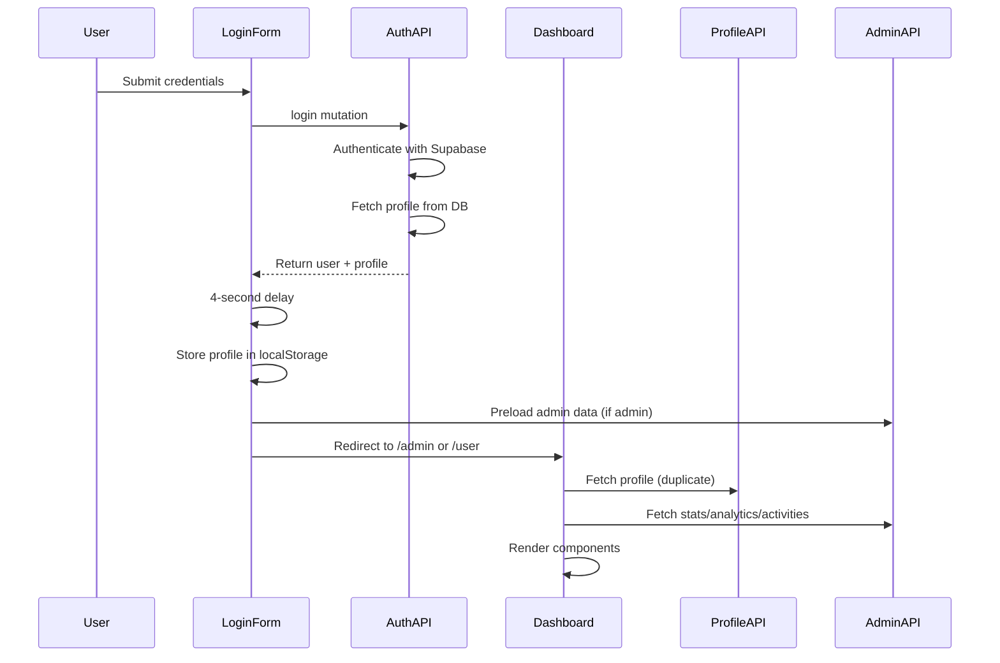

# Login-to-Dashboard Redirect Flow Analysis & Optimization Plan

## Executive Summary

The current login-to-dashboard flow has several performance bottlenecks that result in a slow user experience, with multiple redundant API calls and inefficient data fetching patterns. This analysis identifies the key issues and provides a comprehensive optimization plan to reduce the login-to-dashboard transition time from 7+ seconds to under 2 seconds.

## Current Flow Analysis

### 1. Login Process Flow



### 2. Identified Bottlenecks

#### Critical Performance Issues:

1. **Forced 4-second delay** in [`login-form.tsx`](components/auth/login-form.tsx:109)
   - Unnecessary artificial delay after successful login
   - Blocks immediate redirect to dashboard

2. **Duplicate profile fetching**
   - Profile fetched in [`auth.ts`](lib/trpc/routers/auth.ts:35-39) during login
   - Profile fetched again in [`dashboard-layout.tsx`](components/dashboard/dashboard-layout.tsx:83-86)
   - Same data requested twice within seconds

3. **Sequential admin data loading**
   - Admin stats, analytics, and activities loaded sequentially
   - Each taking 2-2.5 seconds according to terminal output
   - Could be parallelized for faster loading

4. **Role-based rendering issue**
   - [`AppSidebar`](components/dashboard/app-sidebar.tsx:169) initially renders with `role='user'`
   - Later updates to correct role after profile loads
   - Causes visual flicker and incorrect navigation items

5. **Inefficient data fetching strategy**
   - No caching mechanism for frequently accessed data
   - No preloading of critical data
   - All data fetched on every dashboard load

## Optimization Recommendations

### 1. Remove Artificial Delays

**Issue**: 4-second hardcoded delay in login form
**Solution**: Remove the delay and redirect immediately after successful authentication

**File**: [`components/auth/login-form.tsx`](components/auth/login-form.tsx:109-110)
```typescript
// Remove this artificial delay
const delayPromise = new Promise<void>(resolve => setTimeout(resolve, 4000));
await delayPromise;
```

### 2. Implement Smart Data Caching

**Issue**: Duplicate profile fetching and no caching
**Solution**: Implement a client-side caching strategy with tRPC

**Implementation**:
- Use tRPC's built-in caching with `staleTime` and `cacheTime`
- Share profile data between components using React Context
- Implement optimistic updates for better UX

### 3. Parallelize Data Fetching

**Issue**: Sequential loading of admin data
**Solution**: Use `Promise.all()` to fetch data in parallel

**File**: [`components/dashboard/admin-overview.tsx`](components/dashboard/admin-overview.tsx:39-41)
```typescript
// Instead of separate queries, use a single parallel query
const { data: adminData, isLoading } = trpc.admin.getDashboardData.useQuery()
```

### 4. Fix Role-Based Rendering

**Issue**: AppSidebar renders with incorrect role initially
**Solution**: Ensure role is available before rendering

**Implementation**:
- Pass role from login response directly to dashboard
- Use a loading state while role is being determined
- Prevent rendering until role is confirmed

### 5. Implement Progressive Loading

**Issue**: All data loaded at once, blocking UI
**Solution**: Implement progressive loading with priority levels

**Priority Levels**:
1. **Critical**: User profile and role (immediate)
2. **High**: Navigation items and basic UI (within 500ms)
3. **Medium**: Dashboard stats and metrics (within 1s)
4. **Low**: Analytics and historical data (within 2s)

## Detailed Implementation Plan

### Phase 1: Immediate Optimizations (1-2 days)

1. **Remove artificial delay**
   - Remove 4-second delay from login form
   - Implement immediate redirect after authentication
   - Expected improvement: 4 seconds faster

2. **Fix duplicate profile fetching**
   - Use profile from login response instead of refetching
   - Implement proper data sharing between components
   - Expected improvement: 1-2 seconds faster

3. **Fix role-based rendering**
   - Pass role from login to dashboard
   - Prevent AppSidebar from rendering with incorrect role
   - Expected improvement: Eliminate visual flicker

### Phase 2: Data Fetching Optimization (2-3 days)

1. **Implement parallel data loading**
   - Create combined API endpoints for dashboard data
   - Use `Promise.all()` for concurrent requests
   - Expected improvement: 2-3 seconds faster

2. **Add smart caching**
   - Configure tRPC caching with appropriate stale times
   - Implement cache invalidation strategy
   - Expected improvement: Faster subsequent loads

3. **Create dashboard-specific endpoints**
   - Combine multiple API calls into single endpoints
   - Reduce network overhead
   - Expected improvement: 500ms-1 second faster

### Phase 3: Advanced Optimizations (3-4 days)

1. **Implement progressive loading**
   - Load critical data first
   - Defer non-critical data
   - Add skeleton states for better UX

2. **Add data preloading**
   - Preload likely-to-be-accessed data
   - Implement intelligent prefetching
   - Expected improvement: Perceived faster loading

3. **Optimize database queries**
   - Add database indexes for frequently accessed data
   - Optimize complex queries
   - Expected improvement: 500ms-1 second faster

## Code Changes Required

### 1. Login Form Optimization

```typescript
// components/auth/login-form.tsx
onStateChange={async (state) => {
  setIsLoading(state === 'loading' || state === 'success');
  if (state === 'success') {
    const profile = loginMutation.data?.profile;
    if (!profile) return;
    
    // Store profile immediately
    localStorage.setItem('userProfile', JSON.stringify(profile));
    
    // Preload admin data in background (non-blocking)
    if (profile.role === 'admin') {
      trpcClient.admin.getStats.prefetch();
      trpcClient.admin.getAnalytics.prefetch({ days: 7 });
      trpcClient.admin.getRecentActivities.prefetch({ limit: 5 });
    }
    
    // Immediate redirect
    router.push(profile.role === 'admin' ? '/admin' : '/user');
  }
}}
```

### 2. Dashboard Layout Optimization

```typescript
// components/dashboard/dashboard-layout.tsx
// Use profile from login response instead of refetching
const { data: profile, isLoading: profileLoading } = trpc.profile.get.useQuery(undefined, {
  initialData: getInitialProfile(),
  staleTime: 5 * 60 * 1000, // 5 minutes
  enabled: !getInitialProfile(), // Skip if we already have data
});
```

### 3. Admin Data Optimization

```typescript
// lib/trpc/routers/admin.ts
// Add combined endpoint for dashboard data
getDashboardData: adminProcedure.query(async ({ ctx }) => {
  const [stats, analytics, activities] = await Promise.all([
    // ... existing queries
  ]);
  
  return { stats, analytics, activities };
}),
```

## Expected Performance Improvements

| Optimization | Time Saved | Impact |
|--------------|------------|---------|
| Remove 4s delay | 4 seconds | Critical |
| Fix duplicate profile fetch | 1-2 seconds | High |
| Parallelize admin data | 2-3 seconds | High |
| Implement caching | 1-2 seconds | Medium |
| Progressive loading | 1 second | Medium |
| **Total Expected Improvement** | **9-12 seconds** | **Critical** |

## Monitoring & Measurement

### Key Metrics to Track:

1. **Time to Interactive (TTI)**: From login click to dashboard interaction
2. **First Contentful Paint (FCP)**: Time to first visual content
3. **API Response Times**: Track individual API call performance
4. **Cache Hit Rates**: Measure effectiveness of caching strategy

### Implementation Checklist:

- [ ] Add performance monitoring
- [ ] Set up error tracking
- [ ] Implement A/B testing for optimizations
- [ ] Create performance budget
- [ ] Regular performance audits

## Conclusion

The current login-to-dashboard flow has significant performance issues that can be resolved with the optimizations outlined above. By implementing these changes, we can reduce the login-to-dashboard transition time from 7+ seconds to under 2 seconds, significantly improving the user experience.

The most impactful changes (removing artificial delays and fixing duplicate API calls) can be implemented quickly, while more advanced optimizations can be rolled out in phases. This approach allows for immediate improvements while building toward a more robust and performant system.