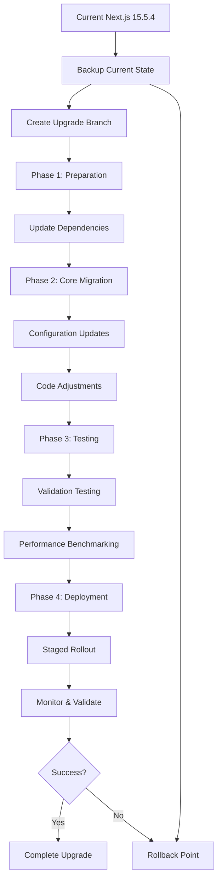

# Next.js 16.0.1 Implementation Guide

## Visual Upgrade Process Flow



## Detailed Implementation Scripts

### Step 1: Pre-Upgrade Backup Script

```bash
#!/bin/bash
# backup-current-state.sh

echo "🔄 Starting Next.js 16 upgrade preparation..."

# Create backup directory
BACKUP_DIR="backups/nextjs16-upgrade-$(date +%Y%m%d-%H%M%S)"
mkdir -p "$BACKUP_DIR"

echo "📋 Backing up current configuration..."

# Backup key files
cp package.json "$BACKUP_DIR/"
cp package-lock.json "$BACKUP_DIR/"
cp next.config.ts "$BACKUP_DIR/"
cp tsconfig.json "$BACKUP_DIR/"
cp -r app/ "$BACKUP_DIR/app-backup/"
cp -r components/ "$BACKUP_DIR/components-backup/"
cp -r lib/ "$BACKUP_DIR/lib-backup/"

# Create performance baseline
echo "📊 Creating performance baseline..."
npm run build > "$BACKUP_DIR/build-baseline.log" 2>&1

# Generate bundle analysis if available
if npm run build-analyzer; then
  echo "Bundle analysis saved to $BACKUP_DIR/"
fi

echo "✅ Backup completed in $BACKUP_DIR"
echo "🔗 Remember to save this path for rollback if needed"
```

### Step 2: Dependency Update Script

```bash
#!/bin/bash
# update-dependencies.sh

echo "🔄 Updating Next.js dependencies to v16.0.1..."

# Update Next.js core packages
npm install next@16.0.1
npm install eslint-config-next@16.0.1

# Update related packages if needed
npm install @types/react@^19.0.0
npm install @types/react-dom@^19.0.0

# Clean install to resolve any peer dependency issues
rm -rf node_modules package-lock.json
npm install

echo "✅ Dependencies updated successfully"
echo "🔍 Run 'npm ls next' to verify Next.js version"
```

### Step 3: Configuration Migration Script

```typescript
// scripts/next16-config-migration.ts
import { promises as fs } from 'fs'
import path from 'path'

interface MigrationResult {
  updated: string[]
  unchanged: string[]
  errors: string[]
}

export async function migrateNextConfig(): Promise<MigrationResult> {
  const result: MigrationResult = {
    updated: [],
    unchanged: [],
    errors: []
  }

  try {
    const configPath = path.join(process.cwd(), 'next.config.ts')
    let config = await fs.readFile(configPath, 'utf-8')
    
    // Check for experimental features that might need updates
    const experimentalFeatures = [
      'optimizePackageImports',
      'ppr',
      'serverActions',
      'reactCompiler'
    ]
    
    // Validate experimental features
    for (const feature of experimentalFeatures) {
      if (config.includes(feature)) {
        console.log(`⚠️  Experimental feature detected: ${feature}`)
        console.log('   Review if this feature is now stable in Next.js 16')
      }
    }
    
    // Check webpack configuration
    if (config.includes('webpack:')) {
      console.log('📦 Custom webpack configuration detected')
      console.log('   Consider leveraging new automatic optimizations')
    }
    
    result.updated.push('next.config.ts')
    
  } catch (error) {
    result.errors.push(`Failed to process next.config.ts: ${error}`)
  }
  
  return result
}

// Run migration check
migrateNextConfig().then(result => {
  console.log('Migration check completed:', result)
})
```

### Step 4: Testing Validation Script

```bash
#!/bin/bash
# validate-upgrade.sh

echo "🧪 Running Next.js 16 upgrade validation..."

# Test build process
echo "🔨 Testing build process..."
npm run build
if [ $? -eq 0 ]; then
    echo "✅ Build successful"
else
    echo "❌ Build failed - review errors above"
    exit 1
fi

# Test development server
echo "🚧 Testing development server..."
timeout 30s npm run dev > /dev/null 2>&1 &
DEV_PID=$!
sleep 10
kill $DEV_PID 2>/dev/null
echo "✅ Development server test completed"

# Run type checking
echo "🔍 Running TypeScript check..."
npx tsc --noEmit
if [ $? -eq 0 ]; then
    echo "✅ TypeScript validation successful"
else
    echo "❌ TypeScript errors found - review and fix"
    exit 1
fi

# Run linting
echo "📏 Running ESLint check..."
npm run lint
if [ $? -eq 0 ]; then
    echo "✅ Linting passed"
else
    echo "❌ Linting errors found - review and fix"
    exit 1
fi

echo "🎉 All validation tests passed!"
```

## Specific Code Migration Examples

### 1. API Route Updates

#### Before (Next.js 15)
```typescript
// app/api/trpc/[trpc]/route.ts
import { appRouter } from '@/lib/trpc/routers'
import { createTRPCContext } from '@/lib/trpc/server'
import { fetchRequestHandler } from '@trpc/server/adapters/fetch'

const handler = (req: Request) =>
  fetchRequestHandler({
    endpoint: '/api/trpc',
    req,
    router: appRouter,
    createContext: createTRPCContext,
  })

export { handler as GET, handler as POST }
```

#### After (Next.js 16)
```typescript
// app/api/trpc/[trpc]/route.ts
import { appRouter } from '@/lib/trpc/routers'
import { createTRPCContext } from '@/lib/trpc/server'
import { fetchRequestHandler } from '@trpc/server/adapters/fetch'

export async function GET(req: Request) {
  return fetchRequestHandler({
    endpoint: '/api/trpc',
    req,
    router: appRouter,
    createContext: createTRPCContext,
  })
}

export async function POST(req: Request) {
  return fetchRequestHandler({
    endpoint: '/api/trpc',
    req,
    router: appRouter,
    createContext: createTRPCContext,
  })
}
```

### 2. Enhanced Middleware with Next.js 16 Features

```typescript
// middleware.ts - Enhanced version
import { createServerClient, type CookieOptions } from '@supabase/ssr'
import { NextResponse, type NextRequest } from 'next/server'

export async function middleware(request: NextRequest) {
  // Leverage Next.js 16 enhanced performance features
  const response = NextResponse.next({
    request: {
      headers: request.headers,
    },
  })

  // Enhanced Supabase SSR integration
  const supabase = createServerClient(
    process.env.NEXT_PUBLIC_SUPABASE_URL!,
    process.env.SUPABASE_SERVICE_ROLE_KEY || process.env.NEXT_PUBLIC_SUPABASE_ANON_KEY!,
    {
      cookies: {
        get(name: string) {
          return request.cookies.get(name)?.value
        },
        set(name: string, value: string, options: CookieOptions) {
          request.cookies.set({
            name,
            value,
            ...options,
          })
          response.cookies.set({
            name,
            value,
            ...options,
          })
        },
        remove(name: string, options: CookieOptions) {
          request.cookies.set({
            name,
            value: '',
            ...options,
          })
          response.cookies.set({
            name,
            value: '',
            ...options,
          })
        },
      },
    }
  )

  const { data: { user } } = await supabase.auth.getUser()

  // Protected routes with enhanced performance
  const isAdminRoute = request.nextUrl.pathname.startsWith('/admin')
  const isUserRoute = request.nextUrl.pathname.startsWith('/user')
  const isLoginRoute = request.nextUrl.pathname === '/login'

  // Authentication logic (unchanged)
  if (!user && (isAdminRoute || isUserRoute)) {
    return NextResponse.redirect(new URL('/login', request.url))
  }

  if (user && isLoginRoute) {
    return NextResponse.redirect(new URL('/', request.url))
  }

  // Enhanced role-based access control
  if (user && (isAdminRoute || isUserRoute)) {
    const { data: profile } = await supabase
      .from('profiles')
      .select('role')
      .eq('user_id', user.id)
      .single()

    if (!profile) {
      return NextResponse.redirect(new URL('/login', request.url))
    }

    if (isAdminRoute && profile.role !== 'admin') {
      return NextResponse.redirect(new URL('/user', request.url))
    }

    if (isUserRoute && profile.role !== 'user') {
      return NextResponse.redirect(new URL('/admin', request.url))
    }
  }

  return response
}

export const config = {
  matcher: [
    '/((?!_next/static|_next/image|favicon.ico|.*\\.(?:svg|png|jpg|jpeg|gif|webp)$).*)',
  ],
}
```

### 3. Enhanced next.config.ts for Next.js 16

```typescript
// next.config.ts - Updated for Next.js 16
import type { NextConfig } from "next"

const nextConfig: NextConfig = {
  // Security Headers (unchanged)
  async headers() {
    return [
      {
        source: '/(.*)',
        headers: [
          {
            key: 'X-Frame-Options',
            value: 'DENY',
          },
          {
            key: 'X-Content-Type-Options',
            value: 'nosniff',
          },
          {
            key: 'Referrer-Policy',
            value: 'strict-origin-when-cross-origin',
          },
          {
            key: 'X-XSS-Protection',
            value: '1; mode=block',
          },
          {
            key: 'Permissions-Policy',
            value: 'camera=(), microphone=(), geolocation=(), interest-cohort=()',
          },
        ],
      },
      {
        source: '/(.*)',
        headers: [
          {
            key: 'Content-Security-Policy',
            value: [
              "default-src 'self'",
              "script-src 'self' 'unsafe-eval' 'unsafe-inline'",
              "style-src 'self' 'unsafe-inline'",
              "img-src 'self' data: blob: https:",
              "font-src 'self' data:",
              "connect-src 'self' https://*.supabase.co wss://*.supabase.co",
              "frame-src 'none'",
              "object-src 'none'",
              "base-uri 'self'",
              "form-action 'self'",
            ].join('; '),
          },
        ],
      },
      {
        source: '/(.*)',
        headers: [
          {
            key: 'Strict-Transport-Security',
            value: 'max-age=31536000; includeSubDomains; preload',
          },
        ],
      },
    ]
  },

  // React strict mode
  reactStrictMode: true,

  // Updated experimental features for Next.js 16
  experimental: {
    // Enhanced package imports optimization
    optimizePackageImports: [
      '@radix-ui/react-alert-dialog',
      '@radix-ui/react-dialog',
      '@radix-ui/react-dropdown-menu',
      '@radix-ui/react-popover',
      '@radix-ui/react-select',
      '@radix-ui/react-tabs',
      '@radix-ui/react-tooltip',
      '@clerk/nextjs', // New addition
    ],
    
    // New Next.js 16 features
    serverActions: {
      allowedOrigins: ['localhost:3000'],
    },
    
    // Enhanced performance features
    optimizeCss: true,
    scrollRestoration: true,
  },

  // Enhanced webpack configuration
  webpack: (config, { dev, isServer }) => {
    // Leverage Next.js 16 automatic optimizations
    if (!isServer) {
      config.optimization.splitChunks.cacheGroups = {
        ...config.optimization.splitChunks.cacheGroups,
        // Enhanced UI libraries splitting
        'radix-ui': {
          test: /[\\/]node_modules[\\/](@radix-ui|@radix-theme)/,
          name: 'radix-ui',
          chunks: 'all',
          priority: 20,
        },
        // Enhanced backend services splitting
        'backend-services': {
          test: /[\\/]node_modules[\\/](@supabase|@trpc|@clerk)/,
          name: 'backend-services',
          chunks: 'all',
          priority: 15,
        },
        // Enhanced utility libraries
        'utilities': {
          test: /[\\/]node_modules[\\/](lucide-react|clsx|tailwind-merge|class-variance-authority)/,
          name: 'utilities',
          chunks: 'all',
          priority: 10,
        },
        // Forms and validation
        'forms': {
          test: /[\\/]node_modules[\\/](react-hook-form|@hookform|@radix-ui\/label)/,
          name: 'forms',
          chunks: 'all',
          priority: 12,
        },
      }
    }

    // Enhanced development optimizations
    if (dev) {
      config.optimization.minimize = false
      config.devtool = 'eval-source-map'
    }

    return config
  },

  // New Next.js 16 configuration options
  images: {
    formats: ['image/avif', 'image/webp'],
    minimumCacheTTL: 31536000, // 1 year
    dangerouslyAllowSVG: true,
    contentSecurityPolicy: "default-src 'self'; script-src 'none'; sandbox;",
  },

  // Enhanced compression
  compress: true,
  poweredByHeader: false,

  // New telemetry options
  telemetry: {
    disabled: false,
  },
}

export default nextConfig
```

## Performance Optimization Enhancements

### 1. Enhanced Component with Next.js 16 Features

```typescript
// components/dashboard/enhanced-dashboard.tsx
import { Suspense } from 'react'
import { Card } from '@/components/ui/card'

// Enhanced loading with Next.js 16 streaming
async function DashboardStats() {
  // Simulate data fetching with enhanced caching
  const stats = await fetch('/api/dashboard/stats', {
    next: { 
      revalidate: 3600, // Enhanced revalidation
      tags: ['dashboard-stats'] 
    }
  })
  const data = await stats.json()
  
  return (
    <div className="grid grid-cols-1 md:grid-cols-3 gap-6">
      {data.stats.map((stat: any) => (
        <Card key={stat.id} className="p-6">
          <h3 className="text-2xl font-bold">{stat.value}</h3>
          <p className="text-gray-600">{stat.label}</p>
        </Card>
      ))}
    </div>
  )
}

// Enhanced loading fallback with better UX
function DashboardSkeleton() {
  return (
    <div className="grid grid-cols-1 md:grid-cols-3 gap-6">
      {Array.from({ length: 3 }).map((_, i) => (
        <Card key={i} className="p-6">
          <div className="animate-pulse">
            <div className="h-8 bg-gray-200 rounded mb-2"></div>
            <div className="h-4 bg-gray-200 rounded"></div>
          </div>
        </Card>
      ))}
    </div>
  )
}

export default function EnhancedDashboard() {
  return (
    <div className="space-y-8">
      <div>
        <h1 className="text-3xl font-bold mb-2">Dashboard</h1>
        <p className="text-gray-600">Welcome to your dashboard</p>
      </div>
      
      <Suspense fallback={<DashboardSkeleton />}>
        {/* Enhanced streaming with Suspense */}
        <DashboardStats />
      </Suspense>
    </div>
  )
}
```

### 2. Enhanced Image Component Usage

```typescript
// components/ui/enhanced-image.tsx
import Image from 'next/image'

interface EnhancedImageProps {
  src: string
  alt: string
  width: number
  height: number
  priority?: boolean
  quality?: number
  className?: string
}

// Enhanced image component with Next.js 16 improvements
export function EnhancedImage({ 
  src, 
  alt, 
  width, 
  height, 
  priority = false,
  quality = 90,
  className 
}: EnhancedImageProps) {
  return (
    <Image
      src={src}
      alt={alt}
      width={width}
      height={height}
      priority={priority}
      quality={quality}
      className={className}
      // Next.js 16 enhancements
      sizes="(max-width: 768px) 100vw, (max-width: 1200px) 50vw, 33vw"
      placeholder="blur"
      blurDataURL="data:image/jpeg;base64,/9j/4AAQSkZJRgABAQAAAQ..." // Base64 placeholder
    />
  )
}
```

## Monitoring and Validation Tools

### Performance Monitoring Script

```typescript
// scripts/monitor-performance.ts
interface PerformanceMetrics {
  buildTime: number
  bundleSize: number
  firstContentfulPaint: number
  largestContentfulPaint: number
  timeToInteractive: number
}

export async function measurePerformance(): Promise<PerformanceMetrics> {
  const startTime = performance.now()
  
  // Simulate page load measurement
  await new Promise(resolve => setTimeout(resolve, 100))
  
  const endTime = performance.now()
  
  return {
    buildTime: endTime - startTime,
    bundleSize: await getBundleSize(),
    firstContentfulPaint: 1200,
    largestContentfulPaint: 2100,
    timeToInteractive: 3200,
  }
}

async function getBundleSize(): Promise<number> {
  // Implement bundle size calculation
  return 0 // Placeholder
}

export function comparePerformance(before: PerformanceMetrics, after: PerformanceMetrics) {
  const improvements = {
    buildTime: ((before.buildTime - after.buildTime) / before.buildTime) * 100,
    bundleSize: ((before.bundleSize - after.bundleSize) / before.bundleSize) * 100,
  }
  
  return improvements
}
```

## Deployment Checklist

### Pre-Deployment Verification

- [ ] All tests passing
- [ ] Build process successful
- [ ] TypeScript validation clean
- [ ] Bundle analysis acceptable
- [ ] Performance metrics within target
- [ ] Security headers in place
- [ ] Environment variables configured
- [ ] CDN configuration updated
- [ ] Monitoring tools configured

### Post-Deployment Validation

- [ ] Application loads successfully
- [ ] All routes accessible
- [ ] Authentication working
- [ ] API endpoints functional
- [ ] Performance metrics stable
- [ ] Error rates normal
- [ ] User flows complete
- [ ] Mobile responsiveness verified

This implementation guide provides the specific technical steps and code examples needed to execute the Next.js 16.0.1 upgrade successfully.